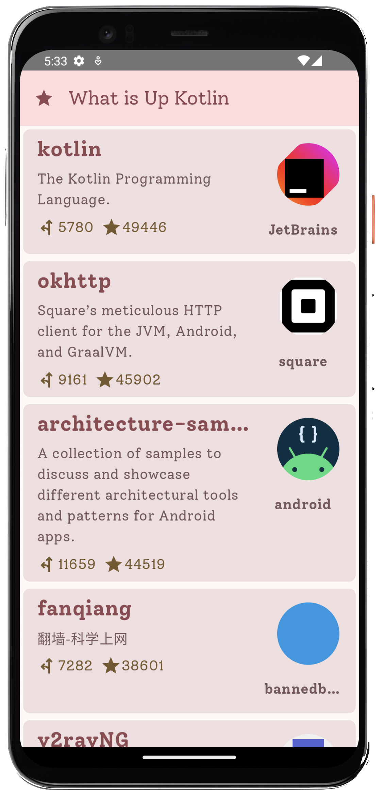
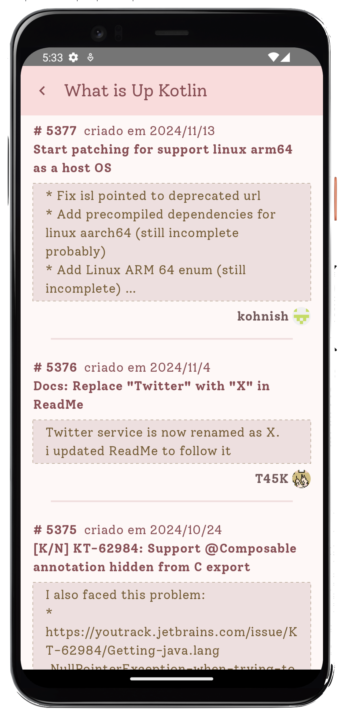

This is a small Kotlin/Compose Multiplatform (targeting Android and iOS) reference project. 

Showcasing how one would use such technology. The app uses the GitHub api to search for the most stargazed repositories and list them on a scrollable, infinite list.
When clicking on an item you will look into the last Pull Requests for that repository, from there you can open that Pull Request on a Browser.

This was developed in 5 days for a Job Interview.

## The app features:
* A Master Detail style view
* Material 3 themes and style guidelines
* Ktor (configured with OkHttp and Darwin clients) for the http requests
* SQLite database coupled with SQLDelight to provide a cache system
* A datasource implementation that will simplify the http requests and cache control leveraging ReactiveX flows
* UI with Compose Multiplatform keeping iOS and Android with parity and common code
* Dependency Injection using Koin
* Image loader and caching with Coil
* Internationalization (pt-Br and en-US)

## Points to improve 
* Ktor, OkHttp and Darwin Clients can have a lot more configuration to deal with http authorization and errors
Currently the API will cap the number of requests
* Use and explore more Githup API, headers have pagination URLs, authorization can be done
* Use Store 4 and Paging 3 instead of a custom Cache (the point of the app was to develop a simple cache and pagination
but we have good libs for that, yet the libs are still not 100% ok in Compose Multiplatform though, almost there)
* But if keeping custom Cache, implement invalidation strategies, time based, save insert dates and remove old ones from the DB
respecting a threshold. Also using this we can decide to not request the API every time, specially for the Repositories.
Pull Requests are more volatile though.
* Error reporting can be more user friendly and well developed with custom views on the bottom bar of the scaffold and 
more human readable errors
* Animate transitions with SharedTransitions
* Layout for tablets with both screens showing at the same time
* Optimize queries to fetch only fields we need instead of all
* CI/CD using github actions
* Previews and Instrumented tests
* Add Desktop versions

## Structure

* `/composeApp` is for code that will be shared across your Compose Multiplatform applications.
  It contains several subfolders:
  - `commonMain` is for code that’s common for all targets.
  - Other folders are for Kotlin code that will be compiled for only the platform indicated in the folder name.
    `iosMain` and `androidMain`.
  - We also have `commonTest` for the common unit tests

* `/iosApp` contains the iOS applications. We need this entry point for the iOS app. 
You need to open this folder on Xcode to add your signature credentials if you want to build it for the emulator or iOS devices.

* Most of the code is inside `commonMain` though there you will find:
  - `sqldelight` those are .sq (schema) files that are used to create the entities and functions 
  to manipulate them
  - kotlin source code

Learn more about [Kotlin Multiplatform](https://www.jetbrains.com/help/kotlin-multiplatform-dev/get-started.html)…

